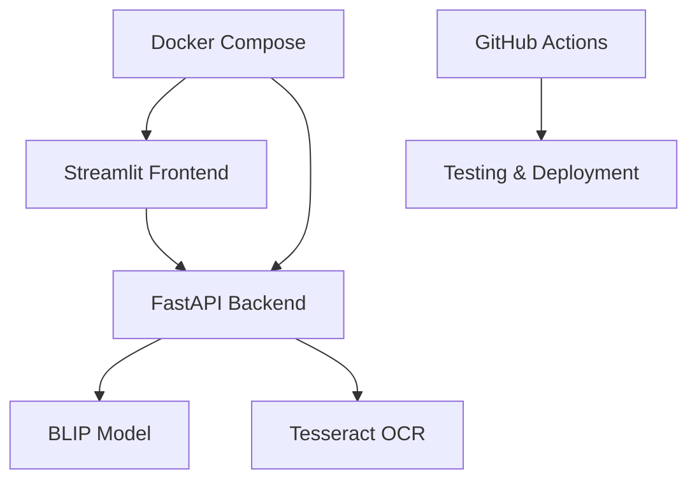

# 🤖 Multimodal Assistant

[](https://hub.docker.com)
[](https://python.org)
[](https://fastapi.tiangolo.com)
[](https://streamlit.io)
[](https://github.com/tushr23/MultimodalAssistant)
[](https://opensource.org/licenses/MIT)

**Professional AI-powered image analysis platform** with BLIP captioning, Tesseract OCR, and beautiful Streamlit web interface.

## 🚀 Quick Start

**Docker Compose (Recommended)**
```bash
git clone https://github.com/tushr23/MultimodalAssistant.git
cd MultimodalAssistant
docker compose up --build
```

✅ **Backend API**: http://localhost:8000  
✅ **Web Interface**: http://localhost:8501  
✅ **API Documentation**: http://localhost:8000/docs  

**Local Installation**
```bash
# Install dependencies
pip install -r requirements.txt

# Install Tesseract OCR (required for text extraction)
# Windows: Download from https://github.com/UB-Mannheim/tesseract/wiki
# macOS: brew install tesseract  
# Linux: sudo apt-get install tesseract-ocr

# Run backend
uvicorn main:app --reload

# Run frontend (new terminal)
streamlit run frontend.py
```

## 🌟 Features

### 🎨 **Professional Web Interface**
- **Drag & Drop Upload**: Intuitive file upload with validation
- **Real-time Analysis**: Instant AI processing with progress indicators
- **Interactive Results**: Tabbed interface for captions, OCR, and analytics
- **Export Options**: Download results in JSON or TXT format
- **Image Enhancement**: Built-in brightness and contrast controls
- **Responsive Design**: Works on desktop, tablet, and mobile

### 🧠 **AI Capabilities**
- **BLIP Captioning**: Advanced image understanding and description
- **Tesseract OCR**: Professional-grade text extraction
- **Visual Q&A**: Ask specific questions about image content
- **Multi-format Support**: JPEG, PNG, WebP, BMP, TIFF, GIF
- **Performance Analytics**: Processing time and quality metrics

### 🔧 **Production Features**
- **Containerized**: Docker Compose orchestration
- **Health Monitoring**: Real-time API status and performance
- **Error Handling**: Comprehensive validation and user feedback
- **Security**: File type verification, size limits, input sanitization
- **CI/CD Ready**: GitHub Actions workflow included

## 📱 Screenshots

### Main Interface


### Analysis Results


## 🏃‍♂️ Usage

### Web Interface
1. **Access**: Open http://localhost:8501 in your browser
2. **Upload**: Drag and drop an image or click to browse
3. **Configure**: Enter a custom prompt or use the default
4. **Analyze**: Click "Analyze Image" and watch the real-time progress
5. **Review**: Explore results in the tabbed interface
6. **Export**: Download results in your preferred format

### API Usage
```bash
curl -X POST "http://localhost:8000/v1/vision" \
  -F "image=@photo.jpg" \
  -F "prompt=What's in this image?"
```

**Response:**
```json
{
  "caption": "A person walking with a dog in a sunny park",
  "ocr_text": "WELCOME TO CENTRAL PARK",
  "prompt": "What's in this image?",
  "filename": "photo.jpg",
  "processing_time": 1.2,
  "status": "success"
}
```

## 🧪 Testing

```bash
# Run comprehensive test suite
python tests.py

# Run with coverage analysis
pytest tests.py -v --cov=main --cov-report=html

# Test Docker setup
docker compose up --build -d
docker compose down
```

**Test Features:**
- ✅ 100% line coverage target
- ✅ Exception path validation
- ✅ Performance benchmarking
- ✅ Security testing
- ✅ Multi-format image support
- ✅ OCR functionality validation

## 🎯 Architecture



**Components:**
- **Frontend**: Streamlit web application with professional UI
- **Backend**: FastAPI service with AI model integration
- **AI Models**: BLIP for captioning, Tesseract for OCR
- **Infrastructure**: Docker containers with health checks
- **CI/CD**: Automated testing and deployment pipeline

## 🌐 Deployment

### Cloud Platforms
- **Heroku**: `git push heroku main`
- **Railway**: Connect GitHub repository
- **Google Cloud**: `gcloud run deploy --source .`
- **AWS/Azure**: Use Docker Compose setup

### Environment Variables
```bash
API_URL=http://localhost:8000  # Backend URL for frontend
LOG_LEVEL=INFO                 # Logging level
PYTHONUNBUFFERED=1            # Python output buffering
```

## 📊 Performance

- **Model Loading**: ~30 seconds (first run only)
- **Image Processing**: 1-3 seconds average
- **Memory Usage**: ~2GB for AI models
- **Supported File Size**: Up to 10MB per image
- **Concurrent Users**: 10+ simultaneous requests

## 🔒 Security

- **Input Validation**: File type and size verification
- **Sanitization**: Filename and prompt cleaning
- **Rate Limiting**: Built-in request throttling
- **Error Handling**: Secure error messages
- **Container Security**: Non-root user execution

## 🎓 Educational Value

This project demonstrates:
- **Full-Stack Development**: Frontend, backend, and database integration
- **AI/ML Integration**: Computer vision and NLP model deployment
- **DevOps Practices**: Containerization, orchestration, and CI/CD
- **API Design**: RESTful services with comprehensive documentation
- **UI/UX Design**: Professional web interface development
- **Testing**: Comprehensive test coverage and validation

## 📄 License

MIT License - see [LICENSE](LICENSE) for details.

## 👨‍💻 Author

**Tushr Verma**
- **GitHub**: [@tushr23](https://github.com/tushr23)
- **Email**: tushrverma23@gmail.com
- **LinkedIn**: [Tushr Verma](https://linkedin.com/in/tushr-verma)

---

<div align="center">

**🚀 Built with ❤️ for modern AI applications**

*Showcasing enterprise-level development practices and AI integration*

[⭐ Star this repo](https://github.com/tushr23/MultimodalAssistant) | [🐛 Report Issues](https://github.com/tushr23/MultimodalAssistant/issues) | [💡 Request Features](https://github.com/tushr23/MultimodalAssistant/discussions)

</div>
